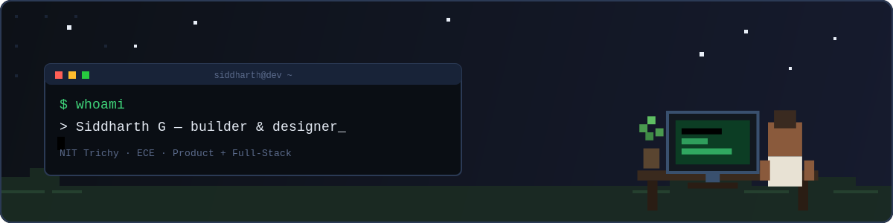

 

 

### Hey, I'm Siddharth 👋

Passionate about product management, UI/UX design, and entrepreneurship, I thrive on turning ideas into reality. As a dedicated student in the field, I'm constantly seeking opportunities to learn, grow, and connect with like-minded professionals. With a knack for problem-solving, I'm driven to create innovative solutions that make a real impact.

### 📫 Let's build something

 

## 🧰 Stack

**Languages**
 

**Frontend / Product**
 

**Backend / Data / ML**
 

**Tools**
 

 

## 💼 Experience

<table>
<tr><td width="150"><b>Oracle</b> Software / DevOps Intern May – Jul 2025</td>
<td>Built a Spring Boot microservice replacing manual, Selenium-driven OCI tenancy cleanup with token-authenticated REST APIs — <b>99.5%</b> execution accuracy across <b>1000+ tenancies</b>. Shipped usage-fetching APIs for billing/analytics pipelines and JUnit-validated deploys.</td></tr>
<tr><td><b>AGS Health</b> ML Research Intern May 2024 – Apr 2025</td>
<td>Built an end-to-end ML pipeline (DBSCAN + OpenCV + PyTesseract + ViT) turning <b>200+</b> unstructured documents into structured data, lifting Document Layout Analysis accuracy by <b>60%</b>.</td></tr>
<tr><td><b>Perfios AA</b> Product Management Intern Dec 2022 – Jan 2024</td>
<td>Shaped messaging strategy across <b>6Cr+</b> customer dataset; led a 4-member team delivering PRDs, wireframes, and prototypes for features reaching <b>1B+</b> users on an NBFC-AA licensed platform.</td></tr>
</table>

 

## 🎨 Design & Product Leadership

<b>UI / UX Portfolio</b>
  

 

